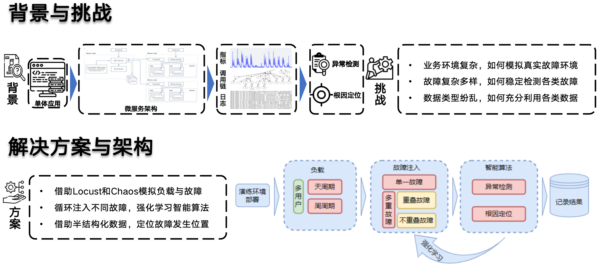
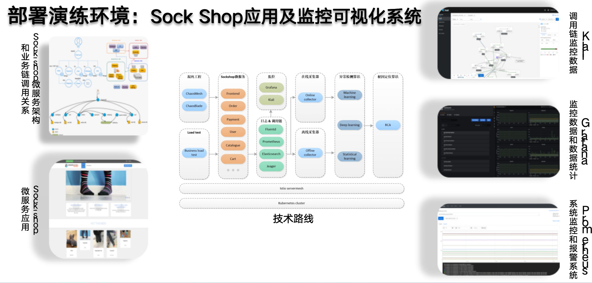
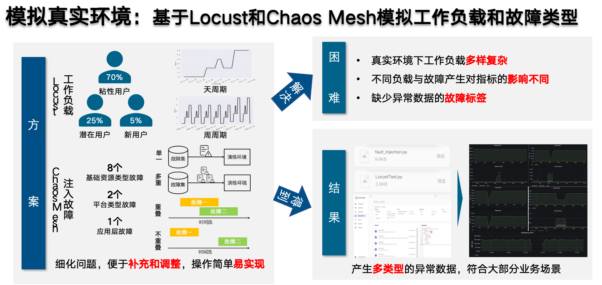
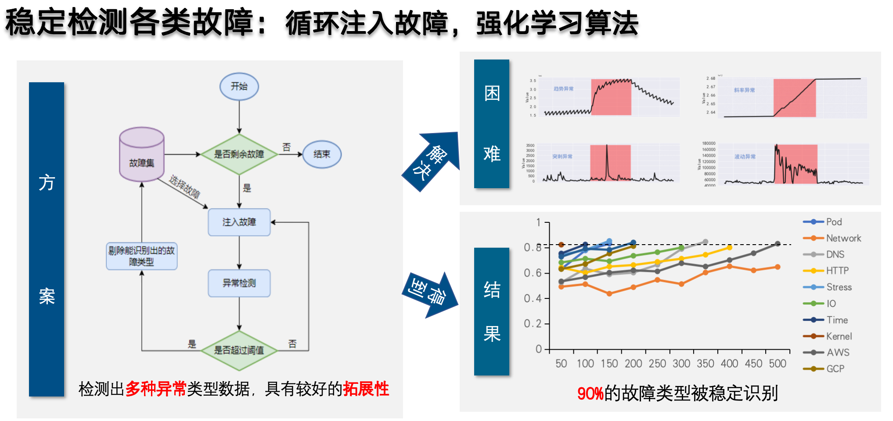
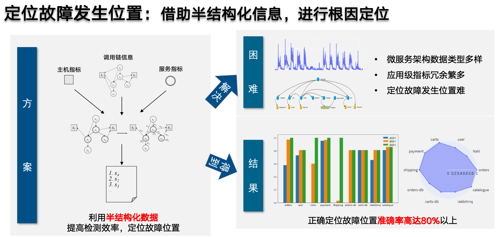
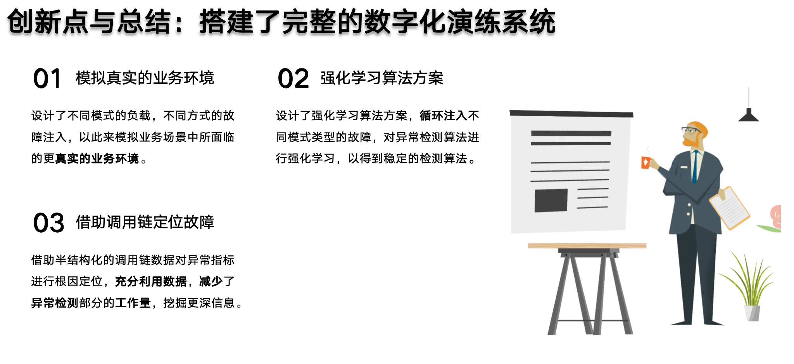

# 微服务架构应用的故障演练数字化 (二等奖)


---

**日期**：2022-07-25                                                           **团队**:zgwl

**成员：** 翟亚雷、xx、xx 、xx                          **辅助成员**:xx、xx

**主要开发环境**: Python3.8、Pytorch(1.10.1+cpu）、statsmodels(0.13.2）、scikit-learn(0.23.2)

### 团队成员


### 背景与挑战



### 部署环境



### 模拟演练



### 检测定界







### 代码结构说明：

DATA

```
|--fault_injection.py
    注入故障：使用自动化故障注入的方式，在k8s环境下注入不同故障
|--data_extract.py
    数据采集：使用网络爬虫技术，从普罗米修斯爬取有效的故障数据
|--anomaly_find.py
    异常检测：分别使用基于统计的、机器学习的、深度学习的方法
|--root_causal.py
    根因定位：使用基于微服务的根因定位算法进行定位根因
|--main_online.py
    线上验证：包含注入故障、采集数据、异常检测、根因定位全过程，运行时间较长
|--main_offline.py
    线下验证：对已经采集好的数据进行不同类型的异常检测、根因定位，运行时间短
```
